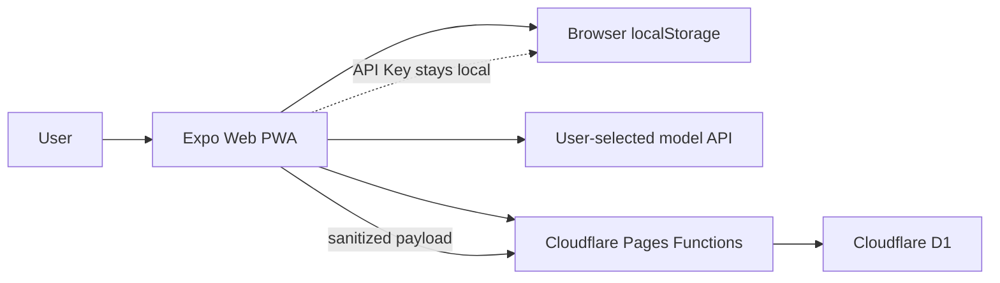
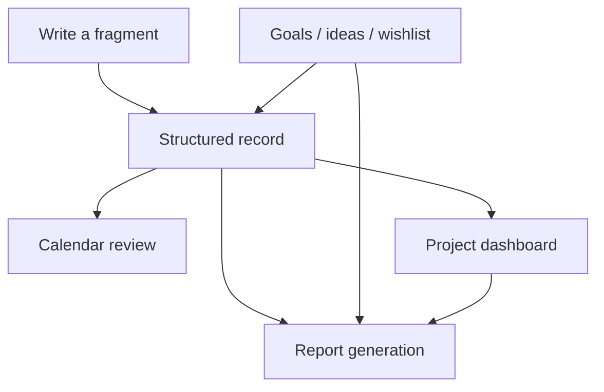

# Architecture

WorkLog is a local-first Expo Web PWA. The app keeps the main writing and reporting loop on the client, then optionally syncs a sanitized payload to Cloudflare D1 after login.

## System Overview

## Frontend

- `App.js` contains the current single-file product shell and UI state.
- `src/worklog` contains record parsing helpers.
- `scripts/prepare-pwa.js` prepares the static PWA assets after Expo export.

## Backend

- `functions/api/[[path]].js` exposes the Pages Functions API.
- `migrations/schema.sql` defines users, sessions, and user data.
- `wrangler.example.toml` documents the required D1 binding.

## Data Flow

1. Records, goals, ideas, wishes, project metadata, model config, and report settings are stored locally.
2. If the user logs in, the app sends a sanitized payload to `/api/data`.
3. The backend stores the payload as JSON in D1.
4. Model API keys are never sent to the backend.

## Synced Payload

Synced after login:

- Entries.
- Goals.
- Ideas.
- Wishes.
- Project archive metadata.
- Report kind and material toggles.
- Report template.
- Model provider, endpoint, and model name.

Never synced:

- Model API keys.
- Exported backup files.
- Browser data outside WorkLog keys.

## Product Loop

